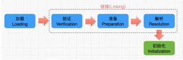

## JVM生命周期

```tex
（1）虚拟机启动：
	*java虚拟机的启动时通过引导类加载器（bootstrap class loader）创建一个初始类（initial class）来完成的，这个类是由虚拟机的具体实现指定的。
（2）虚拟机执行
	*一个运行中的java虚拟机有着一个清晰的任务：执行java程序
	*程序开始执行时他才运行，程序结束时他就停止。
	*执行一个所谓的java程序的时候，真真正正在执行的时一个叫做java虚拟机的进程。
（3）虚拟机退出
	有如下几种情况：
	*程序正常执行结束
	*程序在执行过程中遇到了异常或错误而异常终止。
	*由于操作系统出现错误而导致java虚拟机进程终止。
	*某线程调用Runtime类或System类的exit方式或Runtime类的halt方法，并且java安全管理器也允许这次退出操作。
	*JNI（java native interface）规范描述了用JNI Invocation API来加载或卸载java虚拟机时，java虚拟机的退出情况。

```

## 虚拟机介绍

```tex
（1）Sun Classic Vm
	世界上第一款商用的java虚拟机，jdk1.4时完全被淘汰；hotspot内置了此虚拟机。
	虚拟机内部只提供了解释器。
	如果想使用JIT编译器，就需要进行外挂。一旦使用只能与解释器二选一。
（2）Exact Vm
	Jdk1.2时，sun提供了此虚拟机
	Exact Memory Management:准确式内存管理
	可以知道内存中某个位置的数据具体是什么类型
	热点探测
	编译器与解释器混合工作模式
（3）HotSpot Vm
	Jdk1.3时，成为默认虚拟机
	通过计数器找到最具编译价值代码，触发即时编译或栈替换
	通过编译器与解释器协同工作，在最优的程序响应时间与最优执行性能中取得平衡
```

## 类加载器子系统作用

```tex
*类加载器子系统负责从文件系统或者网络中加载Class文件，Class文件在文件开头有特定的文件标识
*ClassLoader只负责Class文件的加载，至于它是否可以运行，则由Execution Engine（执行引擎）决定。
*加载的类信息存放于一块称为方法区的内存空间。除了类的信息外，方法区中还会存放运行时常量池信息，可能还包括字符串字面量和数字常量（这部分常亮信息是Class文件中常量池部分的内存映射）
```

## 类的加载过程



```tex
加载：
	*通过一个类的全限定名获取定义此类的二进制字节流
	*将这个字节流所代表的静态存储结构转化为方法区的运行时候数据结构
	*在内存中生成一个代表这个类的java.lang.Class对象，作为方法区这个类的各种数据的访问入口
```

```
链接：
	1.验证（Verify）
	*目的在于确保Class文件的字节流中包含的信息符合当前虚拟机要求，保证被加载类的正确性，不会危害虚拟机自身安全。
	*主要包括四种验证：文件格式验证，元数据验证，字节码验证，符号引用验证。
	
	2.准备（Prepare）
	*为类变量分配内存并且设置该类变量的默认初始值。
	*这里不包含用final修饰的static，因为final在变异的时候就会分配了，准备阶段会显式初始化。
	*这里不会为实例变量分配初始化，类变量会分配在方法区中，而实例变量是会随着独享一起分配到java堆中。
	
	3.解析（Resolve）
	*将常量池内的符号引用转换为直接引用的过程。
	*事实上，解析操作往往会伴随着JVM在执行完初始化之后再执行。
	*符号引用就是一组符号来描述所引用的目标。符号引用的字面量形式明确定义在《java虚拟机规范》的Class文件格式中。直接饮用就是直接指向目标的指针，相对偏移量或一个间接定位到目标的句柄。
	*解析动作主要指对类或接口、字段、类方法、接口方法、方法类型等。对应常量池中的CONSTANT_Class_info、CONSTANT_Fieldref_info、CONSTANT_Methodref_info等。
```

